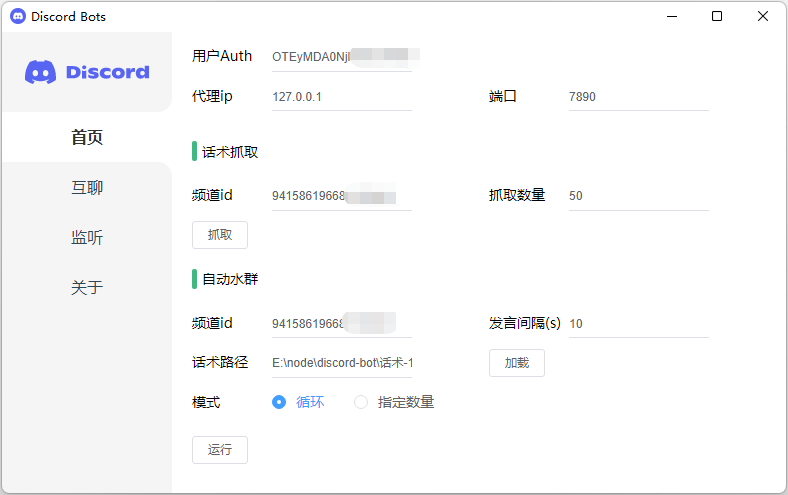
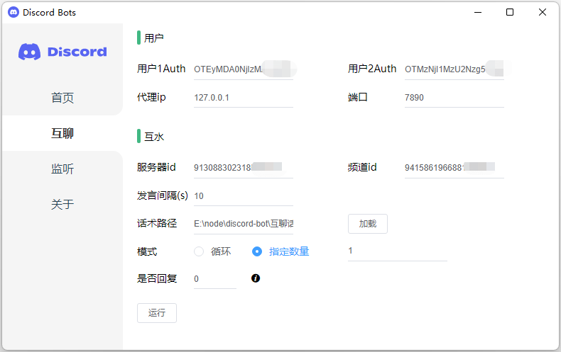
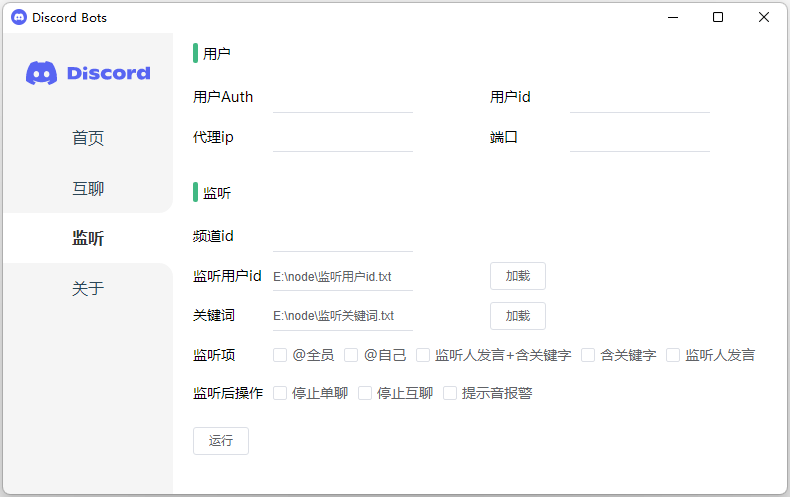

# discord-bot
### 基于Electron构建的GUI版本discord机器人
### 包含了[课程1](https://github.com/Tian508/discord-bot/tree/class1)和[课程2](https://github.com/Tian508/discord-bot/tree/class2)中介绍的功能： 自动水群 自动互聊 自动监控 功能

## How to use?
#### 用户Auth的获取：请参考[课程1中的教程](https://mirror.xyz/0x3595801c3bd933E1a97c5c679B77A4306739223f/X1E-WmxTxfqlybAV0hUbwBjISsG7THXlpaQhB9tcjhA)
#### 用户id、服务器id、频道id的获取：打开discord的开发者模式，在用户、服务器、频道上右键即可看到复制id的选项

- 首页包含话术抓取和水群功能
- 代理ip和端口非必填项，请根据你的网络环境判断是否需要填写
- 填写话术抓取下的频道id和抓取数量，点击运行即可抓取该频道内指定数量的聊天记录，请自行整理加工成可用的话术文本
- 填写水群配置后将整理好的话术文件路径填入后点击加载后即可开始运行

- 互聊功能需要配置两个用户Auth，实现两个用户在指定频道内互相聊天
- 服务器id的获取方式同上

- 监听指定频道内的消息
- 监听用户id的文本格式为一行一个用户id
- 关键词同上

## 功能实现教程
[课程1：话术抓取+互聊](https://mirror.xyz/0x3595801c3bd933E1a97c5c679B77A4306739223f/X1E-WmxTxfqlybAV0hUbwBjISsG7THXlpaQhB9tcjhA)

[课程2：消息监控](https://mirror.xyz/0x3595801c3bd933E1a97c5c679B77A4306739223f/zp6zSGj7fYrxT8QWPIFKJ7VCvYZSrbN32SN6DkVOZ5o)

## 联系作者
### 定制版开发中
### 定制版功能计划：批量邀请、智能回复、抽奖监控、监控消息推送(短信、电话、微信、邮箱等方式) 等
### 如需定制功能，可扫码联系作者
